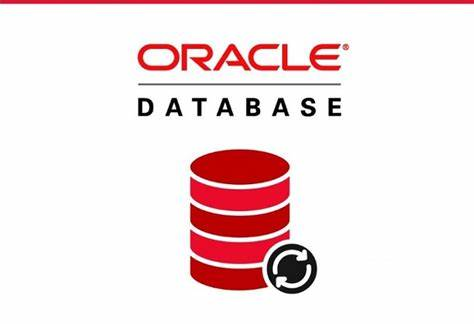

!Hi there 👋
I'm currently working on backend and API projects
I'm currently learning spring boot framework and microservices
I’m looking to collaborate on spring boot framework projects and java projects
----------------------------------------------------------------------------------------------------------------------------

**Programming Languages**

  
 
<a href="https://developer.android.com" target="_blank"> 
</a> <a href="https://www.cprogramming.com/" target="_blank">  &nbsp; &nbsp;
  &nbsp; &nbsp; &nbsp; 
 

**Databases**

   

### Github Streak
----------------------------------------------------------------------------------------------------------------------------

### Github Stats
----------------------------------------------------------------------------------------------------------------------------

  
  

